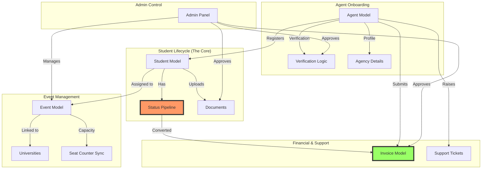

# 🚀 QStudy Agent Portal — Implementation Plan

This document outlines the phased roadmap for completing the QStudy Agent Portal based on the recent audit. It prioritizes data integrity and the core student lifecycle to ensure the platform is functional for business tracking as soon as possible.

---

## 🧩 System Relationship Graph
The following graph visualizes how the different models connect and the flow required to reach the final output (Commission/Invoice).

---

## 📅 Roadmap Phases

### **Phase 1: Core Lifecycle & Data Integrity (CRITICAL)**
*Goal: Fix critical missing links to make the student journey trackable and accurate.*

- [x] **Student Status Pipeline:**
    - Add `status` field to `Student` model (Enum: `Registered`, `Contacted`, `Confirmed`, `Attended`, `Converted`).
    - Create API endpoints to update status.
    - Implement UI for Agents and Admins to progress students through the pipeline.
- [x] **Seat Counter Sync:**
    - Implement a backend hook (or middleware) to automatically increment `filledSeats` in the `Event` model upon successful student registration.
- [x] **Duplicate Prevention:**
    - Add validation logic to prevent registering the same email for the same event (unique constraint on `email` + `eventId`).

### **Phase 2: Agent Compliance & Onboarding**
*Goal: Complete the Agent profile and professional verification workflow.*

- [x] **Extended Profile:**
    - Add `agencyName`, `businessRegistrationNumber`, and `fullAddress` to the `Agent` model.
- [x] **Agent Verification State:** Add a `verified` status to the `Agent` model.
- [x] **Onboarding Documents:** Allow agents to upload compliance documents (e.g., ID, Certification).
- [x] **Admin Approval:** Create an interface for Admins to review and verify agents.

### **Phase 3: Document & Quality Control**
*Goal: Organize student documentation for university applications.*

- [x] **Document Categories:**
    - Update the file upload system to include categories: `Passport`, `Transcript`, `LanguageTest`, `Other`.
- [x] **Admin Verification:**
    - Enable Admins to approve or reject specific documents with feedback notes for the Agent.

### **Phase 4: Financial & Support Modules (IN PROGRESS)**
*Goal: Build the two missing standalone systems.*

- [x] **Invoice Management:**
    - [x] Create `Invoice` model (linked to `Agent` and a list of `Student` IDs).
    - [ ] Automated Commission Logic: Logic to auto-calculate based on conversion tiers.
    - [x] Agent UI to raise invoices and Admin UI to mark them as "Paid".
- [x] **Support Ticket System:**
    - [x] Create `Ticket` model (Subject, Description, Priority, Status).
    - [x] UI for Agents to submit issues and Admins to respond/resolve.

### **Phase 5: Analytics & Notifications**
*Goal: Optimization, performance tracking, and user engagement.*

- [x] **Performance Dashboard:**
    - [x] Implementation of conversion metrics (Conversion Rate = Converted / Registered).
    - [x] Charts showing registration trends per Agent/Event.
- [🟡] **Notifications System:**
    - [x] In-app notification center (bell icon) for status updates and verification alerts.
    - [x] Email notifications (console log hooks ready for Resend).
    - [ ] SMS Gateway integration (Twilio/MSG91).

### **Phase 6: Self-Service & Settings (DONE)**
*Goal: Empower agents with profile management and security controls.*

- [x] **Settings Page:**
    - [x] Create a dedicated "Settings" view for Agents and Admins.
- [x] **Profile Management:**
    - [x] Implement `updateMe` API for agents to update agency details, contact info, and address.
    - [x] UI for editing profile in the Settings page.
- [x] **Security Settings:**
    - [x] Authenticated password change UI and API.
- [x] **Preferences & Config:**
    - [x] Notification toggle preferences (UI Mockup).
    - [x] Payment/Bank details configuration for invoices (UI Mockup).

---

## 🛠️ Immediate Next Steps
1.  **Self-Service:** Implement the Settings page and backend API for profile updates.
2.  **Commission Logic:** Finalize the rules for automated commission calculation.
3.  **Support Content:** Expand the FAQ section in the Support page.
4.  **Notifications:** Integrate Twilio for SMS alerts.
